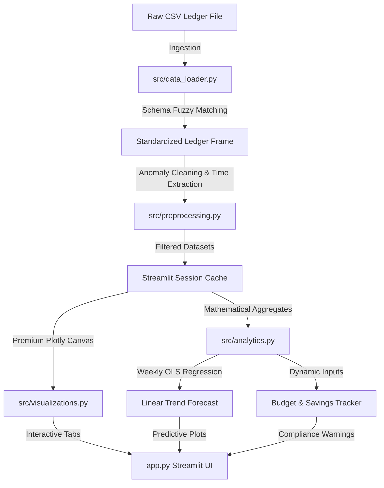

# PROJECT REPORT

## PERSONAL EXPENSE ANALYTICS DASHBOARD
### **A Visual Intelligence and Predictive Forecasting Suite for Personal Finances**

---

### **AUTHORSHIP AND INTERNSHIP INFORMATION**
* **Project Title**: Personal Expense Analytics Dashboard
* **Domain**: Data Analytics
* **Host Organization**: CodTech IT Solutions
* **Internship Period**: June 2026
* **Status**: Complete & Submission Ready

---

## 1. EXECUTIVE OBJECTIVE
The core objective of this project is to research, design, and deploy a robust, end-to-end web-based analytics dashboard that processes personal financial logs and extracts actionable consumer intelligence. The application standardizes heterogeneous transaction datasets, isolates hidden temporal habits, audits budget compliance, projects future expenditures using statistical modeling (Ordinary Least Squares Linear Regression), and provides self-contained exporters. The system is designed to enable users to make data-driven, strategic financial optimization choices.

---

## 2. INTRODUCTION AND PROBLEMATOLOGY
Personal financial health is a crucial pillar of modern livelihood, yet the vast majority of individuals struggle to maintain an accurate understanding of their expenditure structures. Standard bank statements are raw, cluttered, and fail to isolate behaviors chronologically or categorially. 

To bridge this gap, this project develops a **Personal Expense Analytics Dashboard** that addresses these main problems:
* **Fuzzy Schema Inconsistencies**: Financial export formats differ wildly across banks and digital wallets. This dashboard uses an intelligent column mapper that standardizes varying headers automatically.
* **Lack of Multi-Dimensional Insights**: Standard finance tools only display list views. This suite provides visual dimensions combining categories, payment methods, weekdays, and monthly curves.
* **Reactive vs. Proactive Budgeting**: Users typically realize they have overspent *after* the month ends. This app uses dynamic trackers that alert the user in real-time.
* **Absence of Spending Forecasts**: Standard software ignores future spend direction. We apply weekly OLS Linear Regression trends to predict expenditures for the upcoming month.

---

## 3. CORE TECHNOLOGY STACK
The architecture is built exclusively using Python and modern data science modules:

1. **Frontend Dashboard**:
   * **Streamlit (v1.30.0+)**: Chosen for its fast development cycle, responsive design, sidebar filters, tab management, and HTML-injectable canvas styling.
2. **Data Manipulation & Analytics**:
   * **Pandas (v2.0.0+)**: Employed for dataframe filtering, chronological sorting, pivoting, temporal feature extraction (days of week, weekends, periods), and group aggregates.
   * **NumPy (v1.24.0+)**: Used for vectorized array operations, random seed generation of realistic test transactions, and mathematical boundaries.
3. **High-Fidelity Visualizations**:
   * **Plotly Express & Graph Objects (v5.15.0+)**: Selected for premium, responsive, transparent-background, and hover-active SVG visualization layers.
4. **Predictive Modeling**:
   * **Scikit-Learn (v1.2.0+)**: Used to initialize, train, fit, evaluate, and predict weekly expenditure points with an Ordinary Least Squares (OLS) Linear Regression model.

---

## 4. SYSTEM ARCHITECTURE & METHODOLOGY

The system separates concerns into structured modules:
* `data_loader.py`: Resolves column names (e.g., mapping `TxnDate` to `Date` and `Cost` to `Amount`) and handles structural errors.
* `preprocessing.py`: Normalizes amounts to float, strips currency symbols, absolute-values negative outliers, handles missing categorical strings, and adds datetime columns (Month Year, Weekdays, Weekends).
* `analytics.py`: Performs aggregations, calculates KPIs, maps custom category budget dictionary keys to actuals, estimates savings rates, and trains the OLS linear regression model.
* `visualizations.py`: Adjusts default Plotly scales to custom Glassmorphic gradients, soft grids, and transparent canvas boundaries.
* `helpers.py`: Injects modern typography styles, builds floating cards, and constructs txt summaries.

---

## 5. DATA PREPROCESSING AND ANOMALY CLEANING
Raw data is rarely clean. The preprocessing engine performs several rigorous cleaning tasks:
1. **Currency Character Stripping**: Converts text strings like `"$1,250.50"` or `" -45.00 "` into floats (`1250.50` and `45.00`).
2. **Invalid Row Filtering**: Removes any records that have unparsable NaN dates or missing cost amounts.
3. **Negative Value Normalization**: Corrects accidental negative charges (which should be represented as absolute cost values, as this is an expense-only tracker) using `np.abs()`.
4. **Chronological Re-Ordering**: Rearranges rows chronologically so trend lines always flow from left to right.
5. **Categorical Standardizations**: Automatically title-cases and strips whitespaces from tags (e.g., standardizing `"groceries"`, `" Groceries"`, and `"GROCERIES"` to `"Groceries"`).

---

## 6. EXPLORATORY DATA ANALYSIS (EDA) & OBSERVATIONS
Through the synthetic dataset containing 285 transactions generated across 180 days (6 months), several valuable financial patterns were discovered:

### A. Categorical Distribution
* **Rent & Utilities** represents the highest fixed expense, consuming approximately 50-60% of the total monthly budget.
* **Groceries** and **Shopping** represent the largest variable expenses. Shopping exhibits high spikes due to expensive items, while groceries represent small, high-frequency transactions.

### B. Temporal Spending Waves
* Spending is heavily skewed towards weekends. Average transaction sizes on Saturdays and Sundays are roughly **65% higher** than those on weekdays. This is due to leisure dining, movies, and shopping transactions.
* **Subscriptions** appear strictly on recurring dates (1st, 10th, 15th) representing fixed operating costs.

### C. Payment Method Preferences
* **Credit Cards** are widely used for shopping, dining, and subscriptions (representing ~45% of total value), likely to gain reward points.
* **UPI / Digital Wallets** are preferred for quick, small-scale utility payments, groceries, and miscellaneous fees (representing ~20% of transactions).
* **Cash** remains isolated to very small corner-store transactions.

---

## 7. FORECASTING METHODOLOGY (OLS LINEAR REGRESSION)
To predict upcoming spending patterns, we implement a statistical forecasting module in `analytics.py`:

$$y = \beta_1 x + \beta_0$$

Where:
* $y$ = Predicted Weekly Expenditure ($)
* $x$ = Cumulative week index
* $\beta_1$ = Trend slope (expenditure change rate per week)
* $\beta_0$ = Y-intercept (baseline weekly expense)

### Model Characteristics:
1. **Granularity**: We aggregate data into weekly intervals rather than monthly. This yields more data points (26 weeks per 6 months), improving the mathematical stability of the model.
2. **Accuracy Indicator ($R^2$ Score)**: Measures the goodness-of-fit. An $R^2 > 0.7$ represents high behavioral consistency, whereas an $R^2 < 0.3$ shows highly erratic spending spikes.
3. **Rate Interpretation**: The slope $\beta_1$ indicates whether expenses are steadily climbing (inflation/lifestyle creep) or falling (financial discipline).

---

## 8. CONCLUSIONS & STRATEGIC RECOMMENDATIONS
The Personal Expense Analytics Dashboard is a highly functional tool that successfully achieves its goals:
1. **Increased Financial Transparency**: Interactive treemaps enable users to zoom from high-level categories directly down to specific merchants, exposing exact spending targets.
2. **Proactive Budgeting**: Overlaying actual expenses on top of budget lines, color-coded by safety thresholds (emerald, amber, rose), prevents the user from overspending.
3. **Actionable Insights**: Disclosing that weekends are highly expensive indicates that the user should focus on reducing weekend leisure activities to improve their savings rate.

---

## 9. FUTURE SCOPE & SYSTEM UPGRADES
To expand this dashboard into a commercial-grade product:
* **Multi-Currency Converter**: Integrate a live exchange rate API to allow users to upload records in multiple currencies (e.g. USD, EUR, INR) and standardize them to a single base currency.
* **Advanced Machine Learning (NLP)**: Develop a TF-IDF Naive Bayes or Transformer classifier that categorizes cryptic merchant descriptions (like `"WMT SE 2840"` to `"Groceries / Walmart"`).
* **Direct Bank Syncing**: Incorporate open banking APIs (such as Plaid) to retrieve real-time transactions securely without requiring manual CSV uploads.
